# HeartCare - Medical Clinic Management System

HeartCare is a comprehensive medical clinic management system designed to streamline patient care, appointment scheduling, medical record management, and administrative tasks. Built with JavaFX and following the MVC architecture, it provides an intuitive interface for healthcare professionals to manage their daily operations efficiently.

## 🏥 Features

### Patient Management
- Register new patients with comprehensive demographic information
- Search and filter patient records
- Edit and update patient information
- View patient history and appointments

### Appointment Scheduling
- Interactive calendar interface for appointment scheduling
- Multiple views for doctors and time slots
- Color-coded appointment status tracking (scheduled, checked-in, in progress, completed, missed, canceled)
- Quick patient check-in process

### Medical Records
- Digital patient medical records
- Track medical history, allergies, medications, and chronic conditions
- Record blood type, insurance information, and previous surgeries
- Secure access controls based on user role

### Payment Processing
- Record and track payments for appointments
- Multiple payment method support (cash, credit card, insurance)
- Generate and print invoices
- Payment history tracking

### User Management
- Role-based access control (Admin, Doctor, Staff)
- Secure authentication with password hashing
- User profiles and contact information
- Permission-based interface elements
- Email-based password recovery system
- Secure user registration workflow

### System Backup & Recovery
- Automated scheduled database backups
- Manual backup creation option
- Comprehensive backup history tracking
- Secure system restoration from backup points
- Configurable backup retention policies
- Backup statistics and monitoring

### Email Notifications
- Password reset via email verification

### Analytics & Reporting
- Daily appointment summaries
- Patient demographics analysis
- Revenue tracking and financial statistics
- Custom date range filtering for reports
- Exportable PDF reports

## 💻 Technical Details

- **Language**: Java
- **UI Framework**: JavaFX
- **Architecture**: Model-View-Controller (MVC)
- **Database**: MySQL
- **Authentication**: BCrypt password hashing
- **Email Service**: JavaMail API
- **Backup System**: Custom SQL export/import implementation
- **Icons**: Ikonli icons
- **PDF Generation**: Apache PDFBox

## 🚀 Getting Started

### Prerequisites
- JDK 11 or later
- MySQL 5.7 or later
- Maven (for dependency management)
- SMTP server access for email functionality

### Database Setup
1. Create a MySQL database named `heartcare`
2. Adjust the database connection settings in `DatabaseSingleton.java`:
   ```java
   private static final String URL = "jdbc:mysql://localhost:3307/heartcare";
   private static final String USER = "root";
   private static final String PASSWORD = "your_password";
   ```
3. Execute the following SQL statements to create the required tables:

```sql
-- Patient table
CREATE TABLE patient ( 
  ID varchar(8) PRIMARY KEY, 
  FNAME varchar(50), 
  LNAME varchar(50), 
  BIRTHDATE date, 
  SEXE enum('male','female'), 
  ADRESSE varchar(255), 
  TELEPHONE int, 
  EMAIL varchar(255), 
  CREATED_AT timestamp DEFAULT CURRENT_TIMESTAMP 
);

-- Medical record table 
CREATE TABLE dossierpatient ( 
  DossierID int AUTO_INCREMENT PRIMARY KEY, 
  PatientID varchar(8), 
  BloodType enum('A-','A+','B-','B+','AB-','AB+','O-','O+'), 
  Allergies text, 
  MedicalHistory text, 
  CurrentMedications text, 
  DateCreated timestamp DEFAULT CURRENT_TIMESTAMP, 
  LastUpdated timestamp DEFAULT CURRENT_TIMESTAMP ON UPDATE CURRENT_TIMESTAMP, 
  BloodPressure varchar(20), 
  ChronicConditions text, 
  PreviousSurgeries text, 
  FamilyMedicalHistory text, 
  InsuranceProvider varchar(100), 
  InsurancePolicyNumber varchar(50), 
  FOREIGN KEY (PatientID) REFERENCES patient(ID) 
);

-- Users table 
CREATE TABLE users ( 
  ID varchar(8) PRIMARY KEY, 
  USERNAME varchar(50) UNIQUE, 
  PASSWORD varchar(255), 
  FNAME varchar(50), 
  LNAME varchar(50), 
  EMAIL varchar(50), 
  TELEPHONE int, 
  ADRESSE varchar(255), 
  BIRTHDATE date, 
  ROLE enum('medecin','admin','personnel'),
  RESET_TOKEN varchar(100),
  RESET_TOKEN_EXPIRY datetime
);

-- Appointments table 
CREATE TABLE rendezvous ( 
  RendezVousID int AUTO_INCREMENT PRIMARY KEY, 
  PatientID varchar(8), 
  MedecinID varchar(8), 
  AppointmentDateTime datetime, 
  ReasonForVisit text, 
  Status enum('Scheduled','CheckedIn','InProgress','Completed','Missed','Rescheduled','Patient_Cancelled','Clinic_Cancelled') DEFAULT 'Scheduled', 
  DateCreated timestamp DEFAULT CURRENT_TIMESTAMP, 
  LastUpdated timestamp DEFAULT CURRENT_TIMESTAMP ON UPDATE CURRENT_TIMESTAMP, 
  StatusReason text, 
  NoShowFlag tinyint(1) DEFAULT 0, 
  RescheduledToID int NULL, 
  CancellationTime datetime NULL, 
  Priority enum('Normal','Urgent') DEFAULT 'Normal', 
  FOREIGN KEY (PatientID) REFERENCES patient(ID), 
  FOREIGN KEY (MedecinID) REFERENCES users(ID), 
  FOREIGN KEY (RescheduledToID) REFERENCES rendezvous(RendezVousID) 
);

-- Appointment history table 
CREATE TABLE rendezvous_history ( 
  HistoryID int AUTO_INCREMENT PRIMARY KEY, 
  RendezVousID int, 
  PreviousStatus enum('Scheduled','CheckedIn','InProgress','Completed','Missed','Rescheduled','Patient_Cancelled','Clinic_Cancelled'), 
  NewStatus enum('Scheduled','CheckedIn','InProgress','Completed','Missed','Rescheduled','Patient_Cancelled','Clinic_Cancelled'), 
  StatusReason text, 
  ChangedBy varchar(50), 
  ChangedAt datetime DEFAULT CURRENT_TIMESTAMP, 
  FOREIGN KEY (RendezVousID) REFERENCES rendezvous(RendezVousID) 
);

-- Payments table 
CREATE TABLE paiment ( 
  PaimentID int AUTO_INCREMENT PRIMARY KEY, 
  PatientID varchar(8), 
  RendezVousID int, 
  Amount decimal(10,2), 
  PaymentMethod enum('Cash',' Credit Card','Insurance'), 
  PaimentDate datetime DEFAULT CURRENT_TIMESTAMP, 
  FOREIGN KEY (PatientID) REFERENCES patient(ID), 
  FOREIGN KEY (RendezVousID) REFERENCES rendezvous(RendezVousID) 
);

-- Payment history table
CREATE TABLE paiment_history (
    HistoryID int AUTO_INCREMENT PRIMARY KEY,
    PaimentID int NOT NULL,
    RendezVousID int NOT NULL,
    PatientID varchar(8) NOT NULL,
    OldAmount decimal(10,2),
    NewAmount decimal(10,2),
    OldPaymentMethod enum('Cash',' Credit Card','Insurance'),
    NewPaymentMethod enum('Cash',' Credit Card','Insurance'),
    ChangedAt timestamp DEFAULT CURRENT_TIMESTAMP,
    ChangedBy varchar(50) NOT NULL,
    ChangeReason text NOT NULL,
    FOREIGN KEY (PaimentID) REFERENCES paiment(PaimentID) ON DELETE CASCADE,
    FOREIGN KEY (RendezVousID) REFERENCES rendezvous(RendezVousID),
    FOREIGN KEY (PatientID) REFERENCES patient(ID),
    INDEX (PaimentID),
    INDEX (RendezVousID),
    INDEX (PatientID)
);

-- User activity log table
CREATE TABLE user_activity_log (
    log_id INTEGER PRIMARY KEY AUTO_INCREMENT,
    user_id VARCHAR(50) NOT NULL,
    username VARCHAR(100) NOT NULL,
    role VARCHAR(50),
    action_type VARCHAR(20) NOT NULL,
    timestamp DATETIME NOT NULL
);


-- Create the backup_schedule table
CREATE TABLE backup_schedule (
    ScheduleID INT AUTO_INCREMENT PRIMARY KEY,
    Enabled TINYINT(1) NOT NULL DEFAULT 1,
    BackupTime TIME NOT NULL DEFAULT '23:00:00',
    BackupFormat VARCHAR(10) NOT NULL DEFAULT 'SQL',
    BackupLocation VARCHAR(255) NOT NULL,
    BackupOnExit TINYINT(1) NOT NULL DEFAULT 0,
    BackupForStartup TINYINT(1) NOT NULL DEFAULT 0,
    RetentionDays INT NOT NULL DEFAULT 30
);

-- Create the backup_history table
CREATE TABLE backup_history (
    BackupID INT AUTO_INCREMENT PRIMARY KEY,
    BackupDateTime DATETIME NOT NULL,
    BackupType VARCHAR(50) NOT NULL,
    BackupFormat VARCHAR(10) NOT NULL,
    BackupPath VARCHAR(255) NOT NULL,
    BackupSize BIGINT NOT NULL,
    BackupStatus VARCHAR(50) NOT NULL,
    BackupDescription TEXT,
    CreatedBy VARCHAR(50) NOT NULL
);
```

### Email Configuration
1. Configure the email settings in `EmailService.java`:
   ```java
   private static final String HOST = "smtp.gmail.com";
   private static final int PORT = 587;
   private static final String USERNAME = "your-email@gmail.com";
   private static final String PASSWORD = "your-app-password";
   private static final boolean AUTH = true;
   private static final boolean STARTTLS = true;
   ```

2. If using Gmail, you'll need to create an "App Password" in your Google Account settings

### Backup Configuration
1. Make sure the application has write access to the backup directory
2. Default backup settings can be configured in the admin interface
3. Initial backup directory is set to `C:\Users\[Username]\Pictures\backups` in the example

### Running the Application
1. Clone the repository
2. Configure the database connection
3. Configure email settings
4. Build the project using Maven: `mvn clean package`
5. Run the application: `java -jar target/HeartCare.jar`

## 📋 Project Structure

- `src/main/java/com/example/myjavafxapp/Models/` - Data models and business logic
- `src/main/java/com/example/myjavafxapp/Controllers/` - UI controllers
- `src/main/java/com/example/myjavafxapp/Components/` -  Application custom components
- `src/main/resources/com/example/myjavafxapp/` - FXML files and resources
- `src/main/resources/Icons/` - Application icons

## 🔐 Security Features
- Password hashing using jBCrypt
- Session management
- Role-based access control
- Secure password reset via email verification
- Regular automated system backups
- User activity logging

## 📊 Screenshots
### Authentication and User Management

#### Connexion au système
The HeartCare login screen provides a secure login interface. Users can enter their credentials, log in, register, or recover a forgotten password. The minimalist design highlights the system name "HeartCare" and its quality.

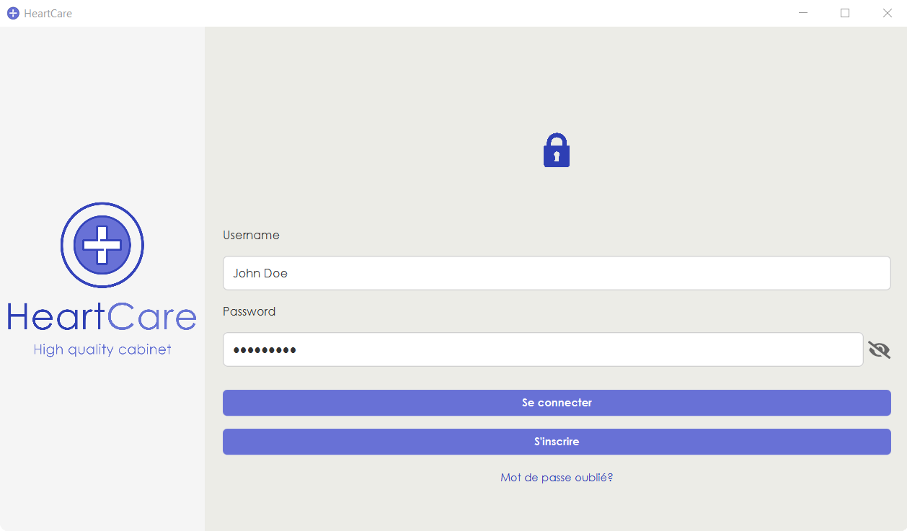

#### Inscription des utilisateurs (CIN)
This interface allows new users to begin registration by entering their National Identity Card (CIN) number. The "Submit" and "Cancel" buttons allow users to either validate or abandon the process.

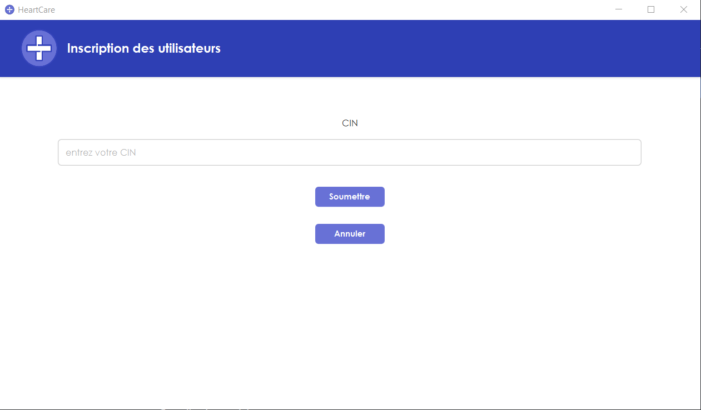

#### Inscription des utilisateurs (Complète)
After validating the CIN, the user accesses this interface to complete registration. They must create a username, password, and confirm it. A personalized welcome message appears (here for "mehdi darnakh").

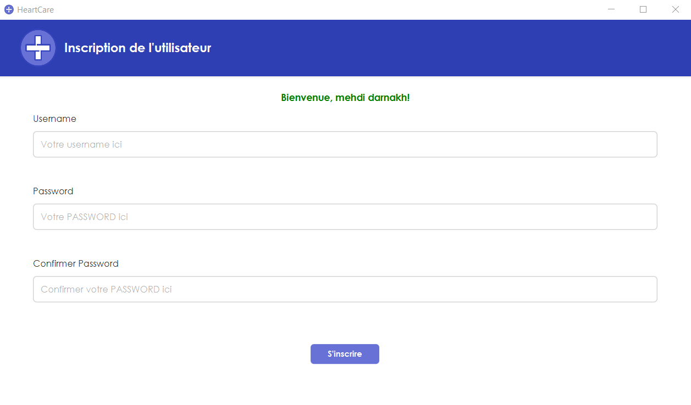

#### Récupération de mot de passe (Étape 1)
For users who have forgotten their password, this interface begins the recovery process by entering the username associated with the account.

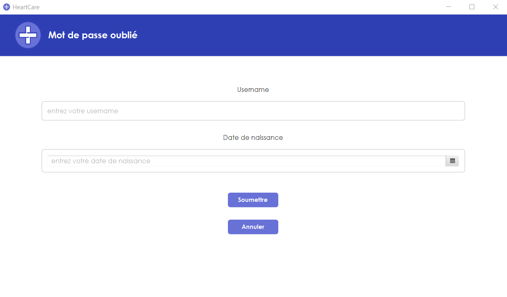

#### Récupération de mot de passe (Étape 2)
After verifying the information, the user (here "salahe_11") will receive an email containing a random 6-digit verification code which he can enter to reset a new password and confirm it. The interface is secure and intuitive for this critical process.

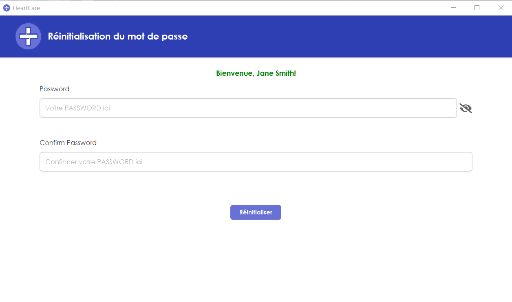

### User Management

#### Liste des Utilisateurs
The User Management interface displays a complete table of registered users, including their CIN, names, roles (admin, staff, or doctor), and contact information. A search bar allows quick filtering. The system applies strict restrictions on the number of users per role: 1 administrator max, 4 staff members max, and 4 doctors max, ensuring secure access management. The "Action" column allows modification or deletion of accounts.

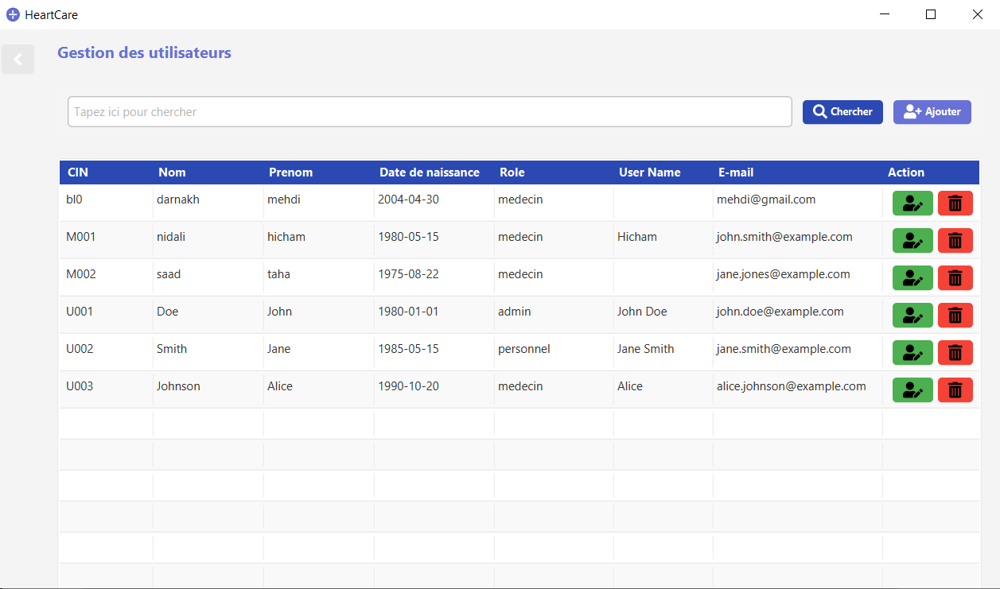

#### Ajout d'un Utilisateur
The Add A User form allows the administrator to create new accounts by entering essential information (CIN, name, role, date of birth, etc.). The system automatically checks role quotas before validation. This interface ensures that only authorized users are added, respecting the limits defined for each role type.

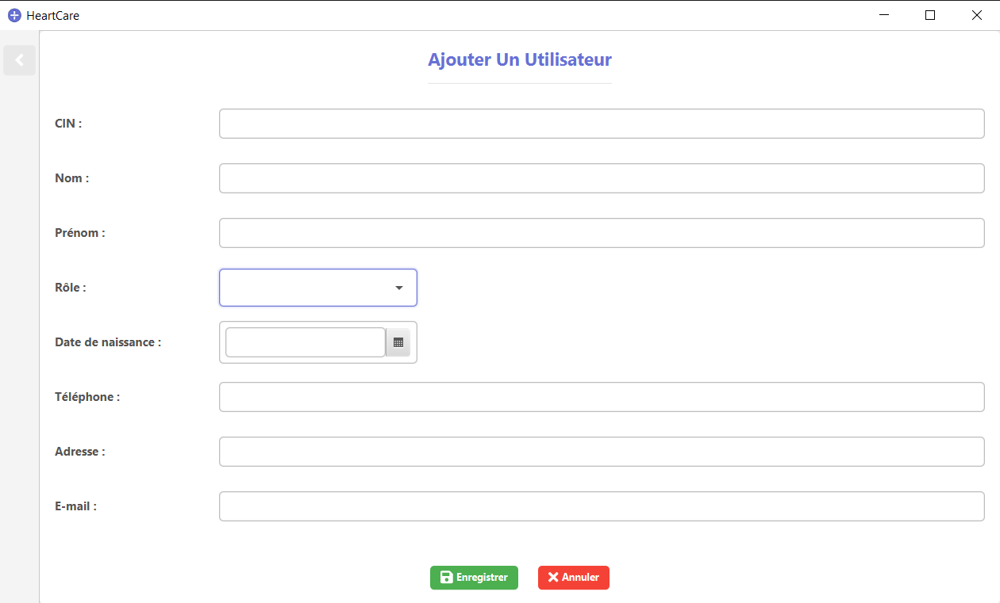

### Patient Records Management

#### Gestion des dossiers patients
This central interface allows doctors and administrators to search, add, and modify patient records. On the left, a dropdown list displays all registered patients; in the center, general information (ID, name, date of birth, gender, address, telephone, email) and, below, detailed appointment history (date, time, doctor, reason, status, and quick access to details). Two buttons "Modify Patient" and "Medical Record" allow data updates, while a "New Appointment" button offers a shortcut to schedule a next consultation. Doctors and administrator have full access to this data, unlike staff, who only have restricted access to insurance information.

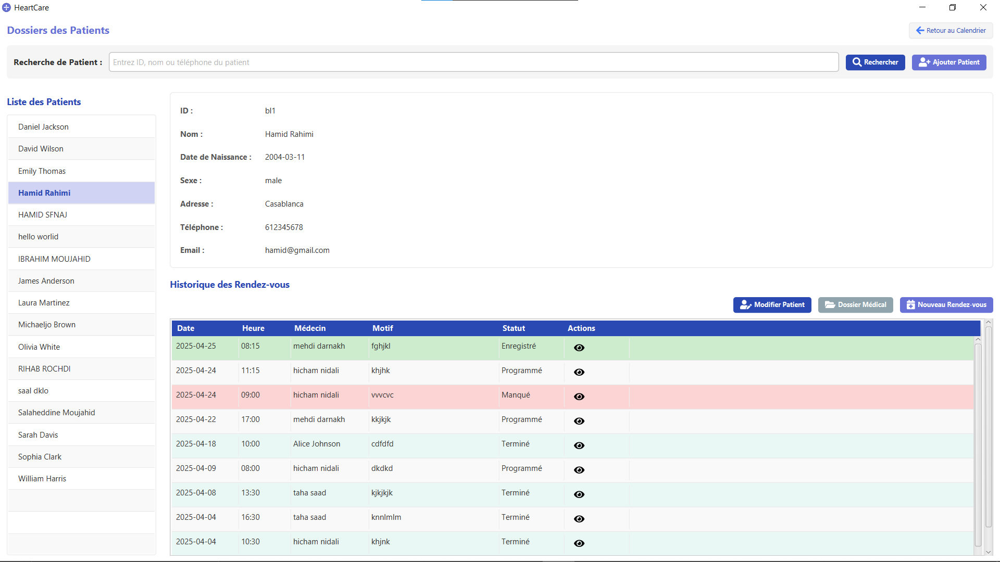

#### Dossier médicale complète (médecins & admin)
This "Patient Medical Record" view displays the entire medical history: blood type, allergies, current treatments, blood pressure, chronic diseases, surgical and family history, as well as creation and last update dates. An editable form allows doctors and administrators to enter or correct this information, then save or cancel changes via the buttons at the bottom of the page. Only these users have visibility and modification of all medical history.

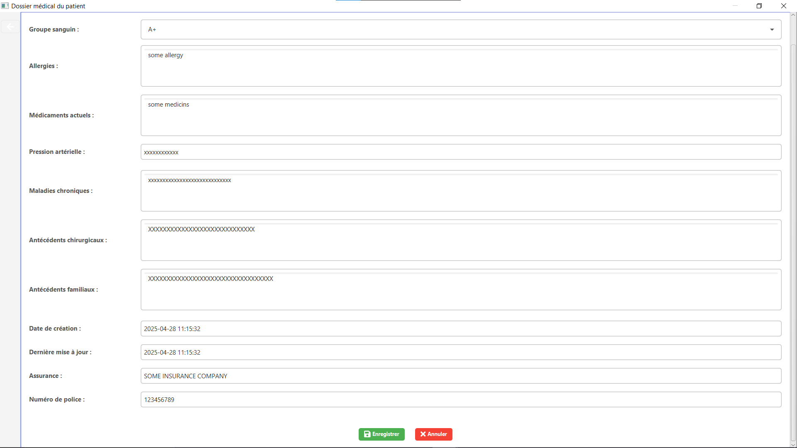

#### Vue simplifiée (personnel)
In this streamlined version of the record, only the administrative part is visible: it shows the creation date, last update date, insurance, and policy number. The title reminds of the patient's identity (CIN and name), but staff only have access to insurance information, without being able to view or modify the rest of the medical record.

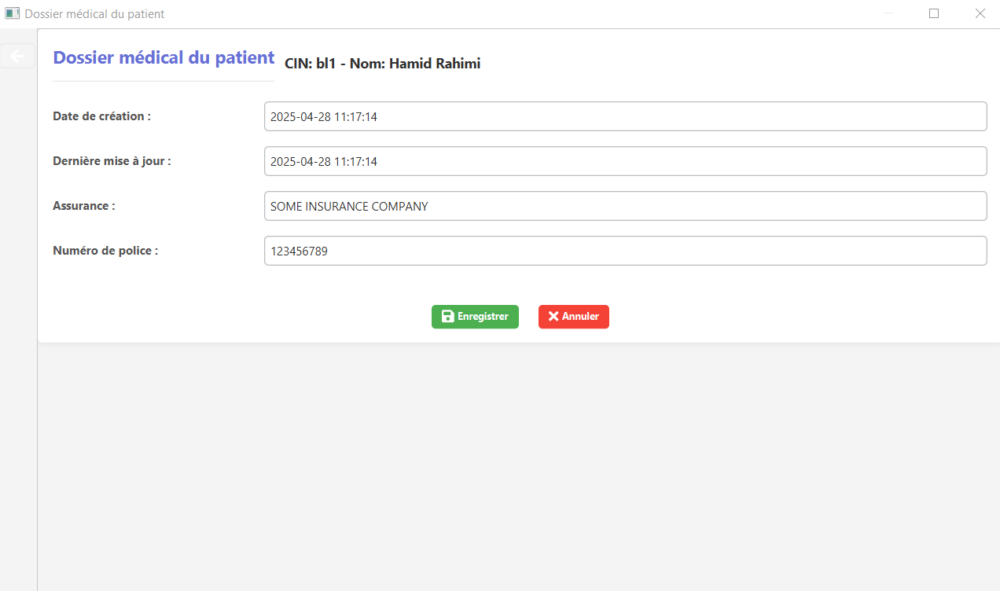

### Analytics and Reporting

#### Tendances des Rendez-vous
In this tab, the administrator has a global overview of appointment activity for the selected period via the filtering panel (choice of predefined interval or "From/To" dates). There are four key indicators at the top: total number of appointments, completed and canceled appointments (with percentages), as well as absence rate. A pie chart details the distribution of statuses - registered, scheduled, completed, missed, canceled, rescheduled - and a histogram displays the number of appointments per week. Finally, two tables rank the busiest days and time slots, allowing identification of activity peaks and troughs.

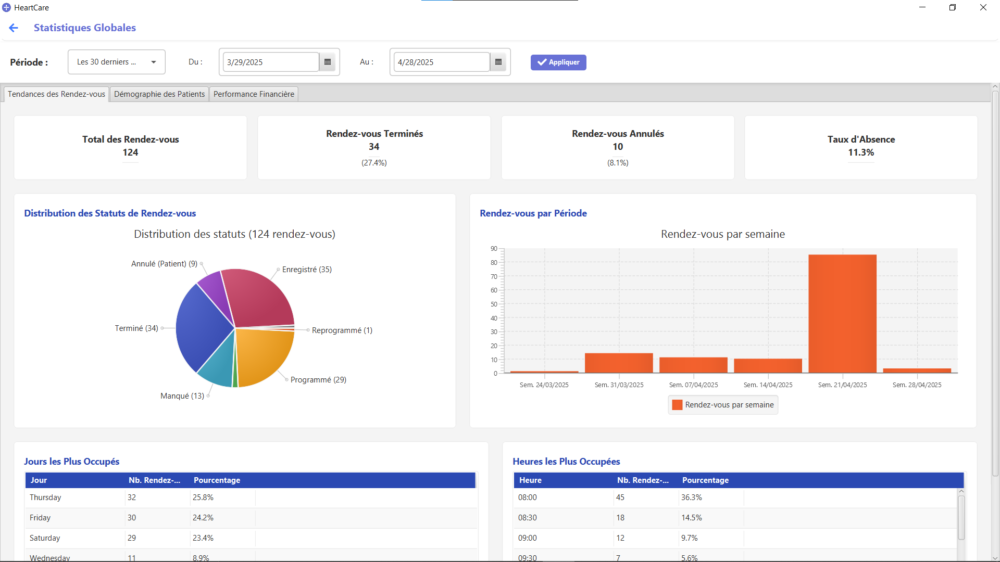

#### Démographie des Patients
This tab provides the administrator with a complete view of the patient composition during the chosen period. It includes the total number of patients, the distinction between new and recurring, as well as a pie chart for the male/female distribution. An adjacent histogram presents the distribution by age groups (0-10, 11-20, etc.), revealing the most represented segments. Finally, a table lists the number of patients per doctor, with percentages, in order to measure each practitioner's engagement.

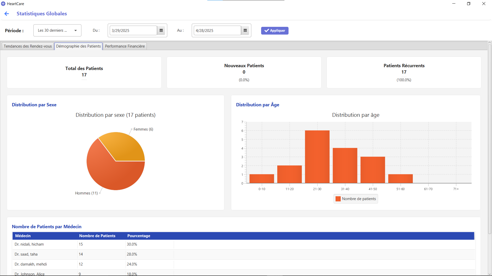

#### Performance Financière
Here, the administrator can evaluate the revenue generated: total revenue, average revenue per appointment and per patient, all in dirhams. The central histogram illustrates the weekly revenue trend, allowing identification of the most profitable weeks. The table at the bottom breaks down revenue by doctor, indicating both the number of billed appointments, total revenue, and each practitioner's relative share in overall revenue.

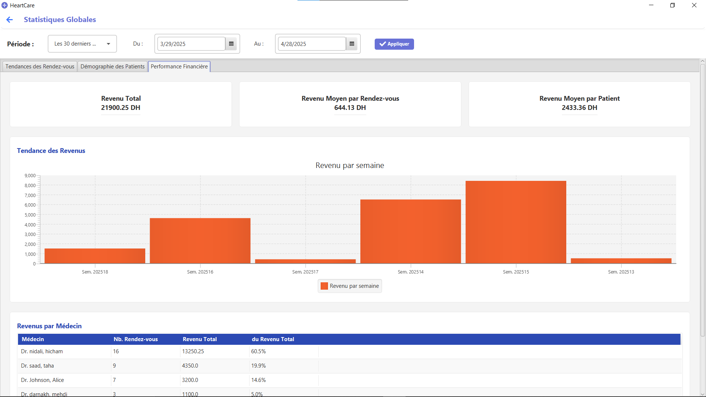

### Payment Processing

#### Main Payment Management Interface
The main payment management interface offers a dual-table layout for complete payment workflow management. The upper table displays today's completed appointments awaiting payment, allowing staff to search by patient CIN to quickly locate specific records. The lower table provides a comprehensive payment history with filtering capabilities by date and patient CIN, displaying payment details including amounts, methods, and patient information. Action buttons in both sections enable efficient payment processing, editing, and invoice generation, with a clear visual indication of payment status.

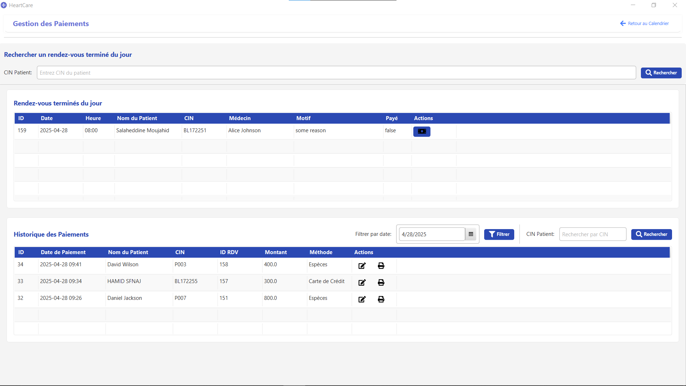

#### Payment Registration Dialog
The payment registration dialog presents a streamlined interface for recording new payments. It clearly displays the patient's name and appointment details at the top for verification, followed by simple input fields for the payment amount and a dropdown menu for selecting the payment method (Espèces/Cash, Carte de Crédit, Assurance). The clean, focused design eliminates distractions, allowing staff to quickly process payments with the prominent "Enregistrer" button, while the "Cancel" option allows easy return to the main interface if needed.

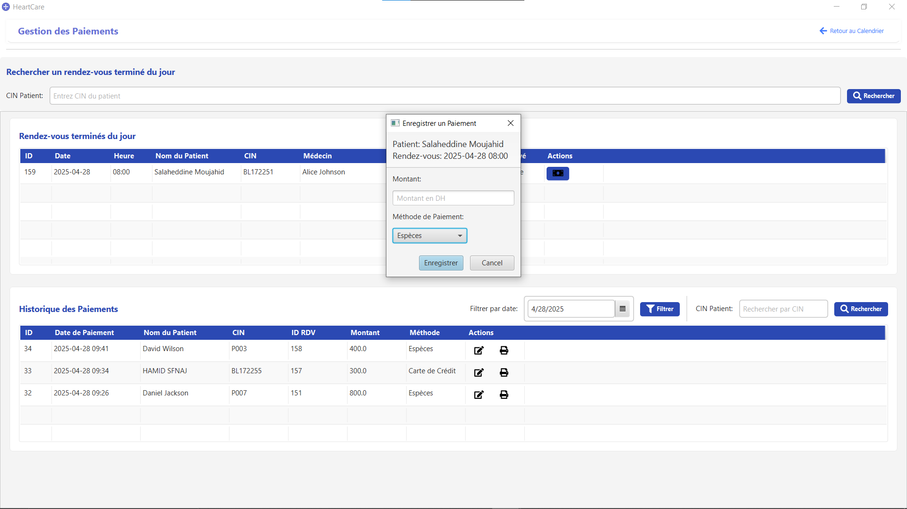

#### Payment Modification Dialog
The payment modification dialog provides a secure way to edit same-day payments with full accountability. It displays the payment ID being modified and allows staff to adjust the payment amount or change the payment method through a simple dropdown. The interface includes a mandatory reason field labeled "Raison de la modification (obligatoire)" that requires justification for any changes, ensuring proper documentation for audit purposes. The system preserves modification history while maintaining a clean, intuitive interface for quick adjustments.

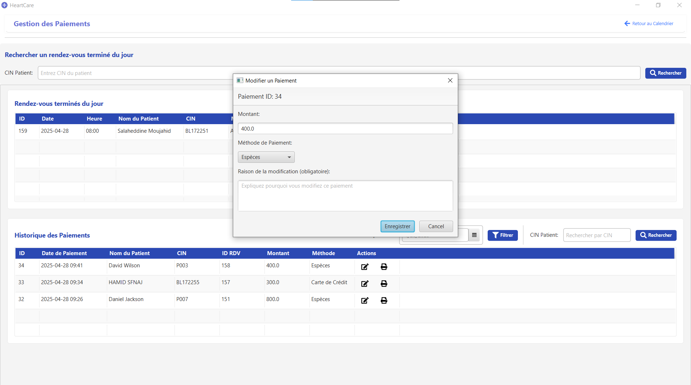

#### Payment Invoice
The payment invoice presents a professional, well-structured receipt for patient payments. It features the clinic's information at the top, followed by clearly labeled sections for invoice details (number and date), patient information, appointment specifics (including doctor and reason for visit), and payment details (amount and method). The document includes designated signature areas for both staff and patient, providing a legally compliant record of the transaction. The clean, minimal design ensures all critical information is easily readable, making it suitable for both print and digital distribution.

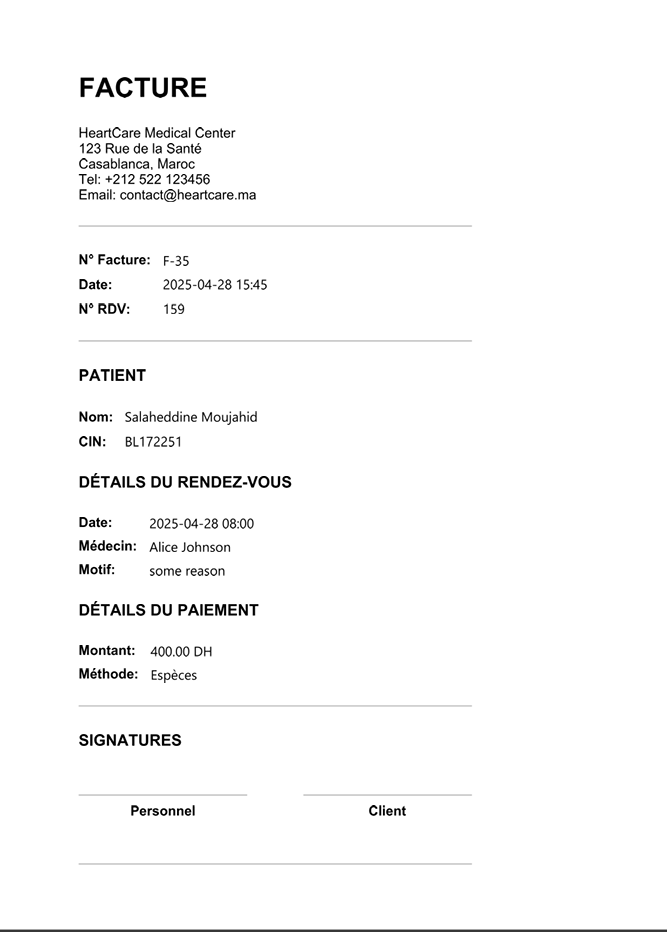

### Reports

#### Daily Report Interface
The "Rapport Quotidien" interface provides clinic administrators with a comprehensive daily overview of appointment activity and patient flow. Users can easily select specific dates through the date picker at the top, with a prominent "Télécharger en PDF" button allowing instant report export. The interface displays a warning that the report is partial if the day isn't finished yet. The report is organized into clear sections: a summary showing total appointments (4), completed appointments (4), cancellations (0), and total patients seen; a detailed patient list table showing each patient's CIN, name, appointment time, and payment method; and a patient flow analysis section highlighting peak hours and appointment distribution throughout the day. This at-a-glance dashboard gives administrators immediate insights into daily clinic operations.

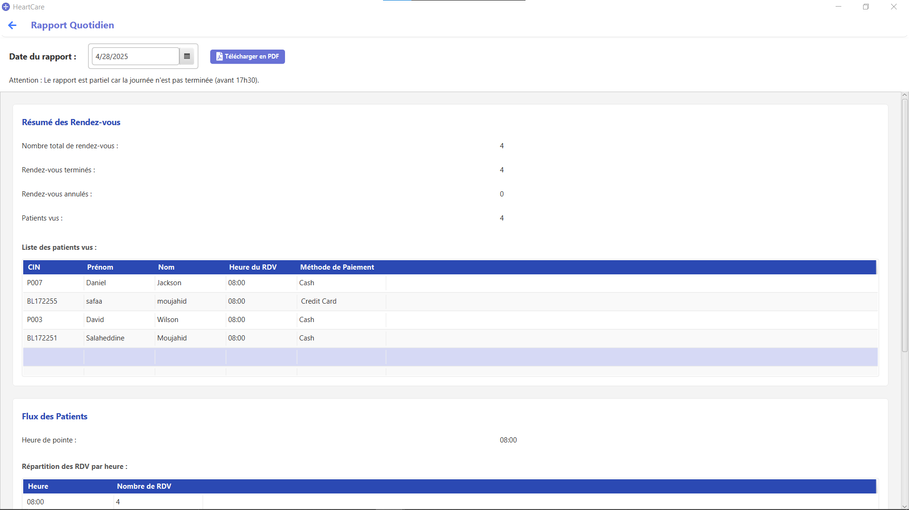

#### PDF Report Output
The exported PDF report maintains the same structured layout as the on-screen version, formatted for print with the clinic's letterhead. It includes all sections from the online report: summary statistics, patient list, and hourly distribution analysis. The PDF format allows for easy sharing with clinic management or archiving for compliance purposes.

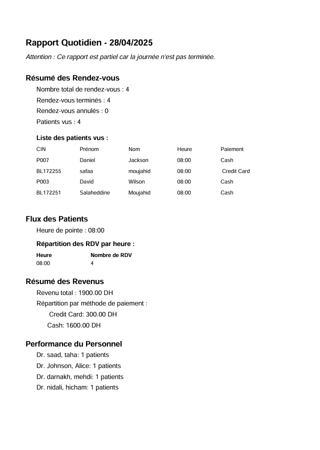

### Appointment Management

#### Calendar View
This is the main calendar interface implemented in CalendarViewController.java and defined in CalendarView.fxml. It displays a time-based grid showing appointments for multiple doctors with color-coded status indicators. The interface includes navigation buttons, date selection, doctor and status filters, and a summary panel on the right showing daily statistics and upcoming appointments. The grid is dynamically populated with appointment blocks that can be clicked to manage appointments.


#### New Appointment Form
This appointment creation/editing interface is implemented in AppointmentFormController.java and defined in AppointmentForm.fxml. It provides a form for entering patient details (with search functionality), selecting doctors, choosing date and time, entering visit reasons, setting priority (normal or urgent), and adding notes. The form adapts based on whether it's creating a new appointment or editing an existing one, showing additional status options for existing appointments.

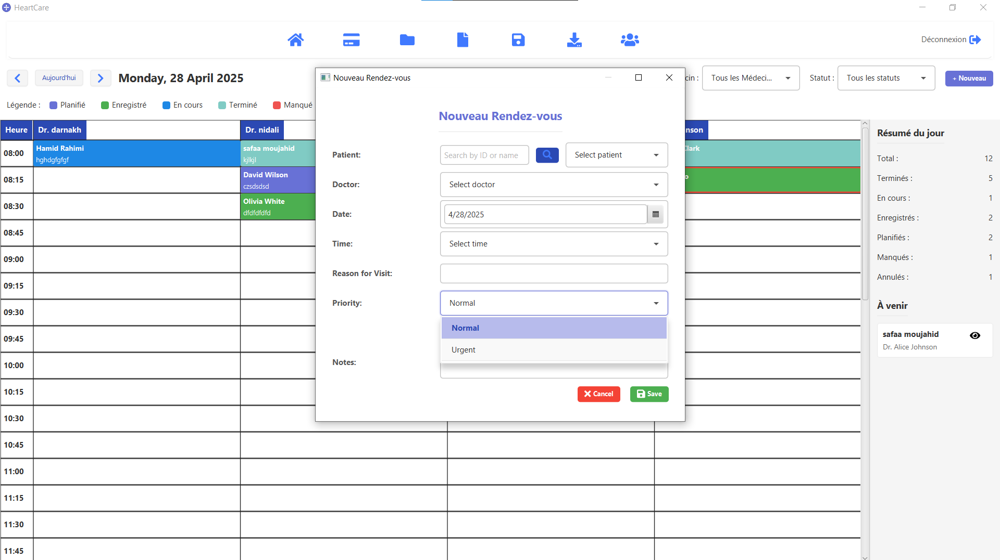

#### Appointment Actions (Scheduled Status)
This dialog is generated by the showAppointmentActionsDialog method in CalendarViewController.java. It displays actions available for a scheduled appointment, showing patient details and offering options to view/modify the appointment, register the patient's arrival (check-in), mark as missed, or cancel the appointment. These options change dynamically based on the current status of the appointment.

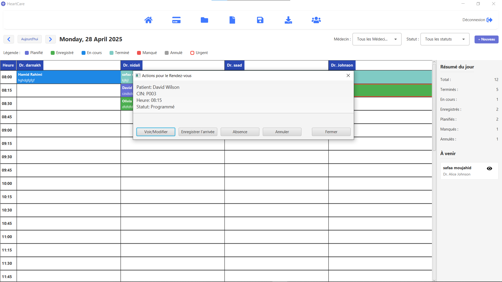

#### Appointment Actions (Checked-In Status)
Generated by the same method as Image 3, this dialog shows actions available for a checked-in patient. The patient is marked as "Enregistré" (registered/checked-in) and the dialog offers options to view/modify the appointment details or start the consultation, which would change the appointment status to "In Progress" through the handleStartAppointment method.

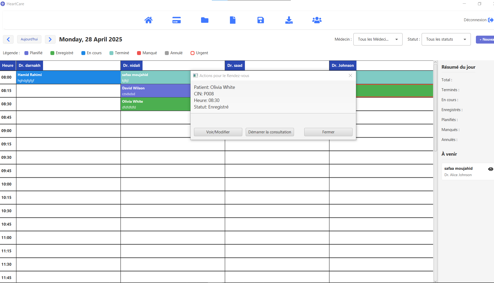

#### Appointment Actions (In Progress Status)
This dialog shows actions for an appointment currently in progress, created by the showAppointmentActionsDialog method. It displays details for a patient currently with the doctor and offers options to view/modify or complete the appointment. Selecting "Terminer" would trigger the handleCompleteAppointment method, prompting for final notes and changing the status to "Completed."

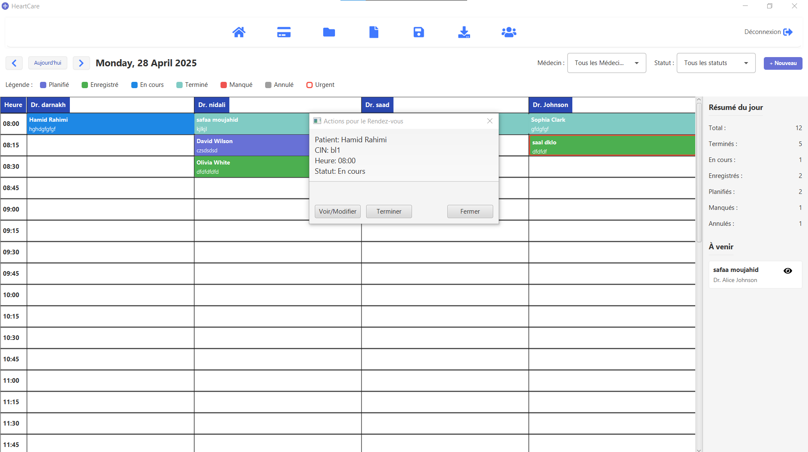

#### Cancel Appointment Dialog
Implemented in the handleCancelAppointment method, this dialog allows users to cancel an appointment by selecting the cancellation type (by patient or by clinic) and entering a reason. The cancellation is processed differently based on the selected type, with the system tracking who canceled and when, stored in the Appointment object and database.

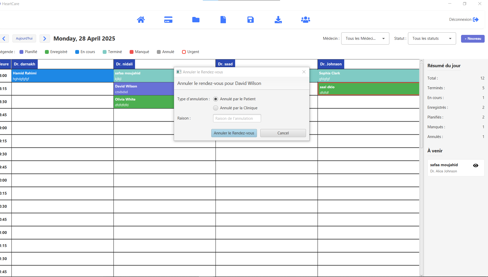

#### Mark as Missed Dialog
Created by the handleMissedAppointment method, this simple dialog prompts for a reason when marking a patient as absent from their appointment. Upon confirmation, it updates the appointment status to "Missed" and sets the noShowFlag to true in the database. This also potentially triggers the appointment shifting functionality to fill the gap.

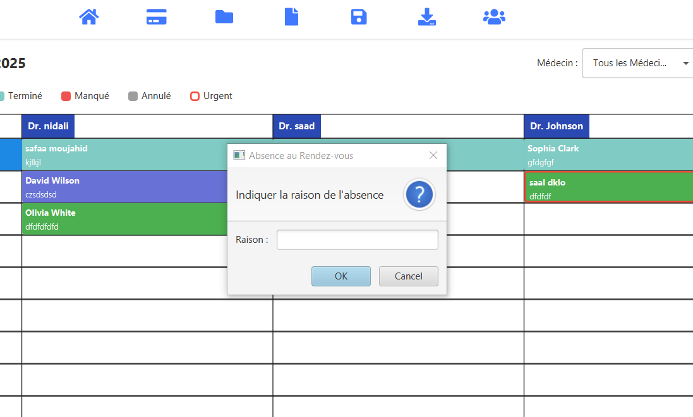

#### Appointment Actions (Missed Status)
This dialog shows actions available for a missed appointment through the showAppointmentActionsDialog method. It displays the missed status and offers options to view/modify or reschedule the appointment. The reschedule option would trigger the handleRescheduleAppointment method which displays the rescheduling dialog.

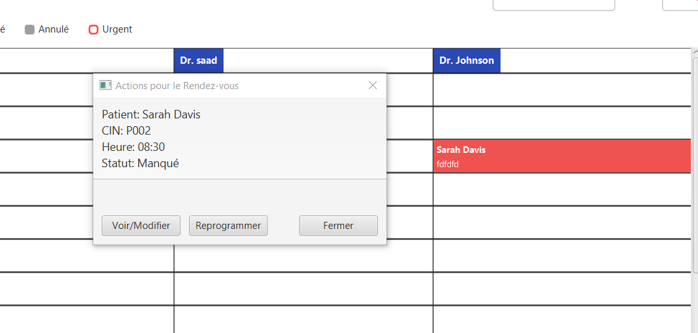

#### Reschedule Appointment Dialog
Generated by the handleRescheduleAppointment method, this dialog allows rescheduling a missed appointment by selecting a new date and time and providing a reason. The system creates a new appointment record while updating the original one to "Rescheduled" status with a reference to the new appointment ID, maintaining a history of the change.

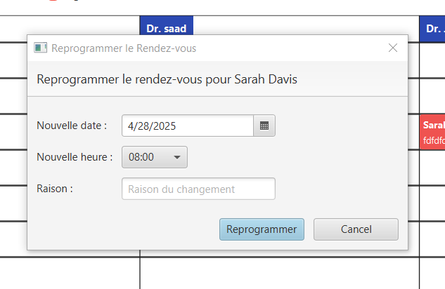

### System Backup & Recovery

#### Backup History
This interface displays a comprehensive history of all system backups. It includes a tabbed navigation system for switching between backup functions, filtering options, and a detailed table view showing backup ID, date/time, type (automatic/manual), format, size, status, creator, and file path. Action buttons allow users to restore backups, open the backup location, delete backups, or view additional details.

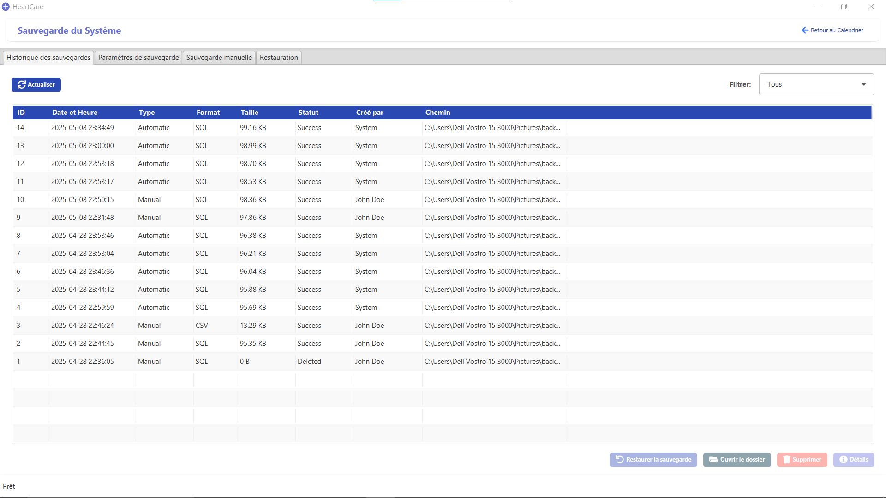

#### Automatic Backup Settings
This interface allows administrators to configure automatic backup settings. Options include enabling/disabling automatic backups, scheduling daily backup times, selecting backup formats, setting storage locations, configuring application shutdown/startup backups, and setting backup retention periods. The interface provides a clear way to ensure regular database protection.

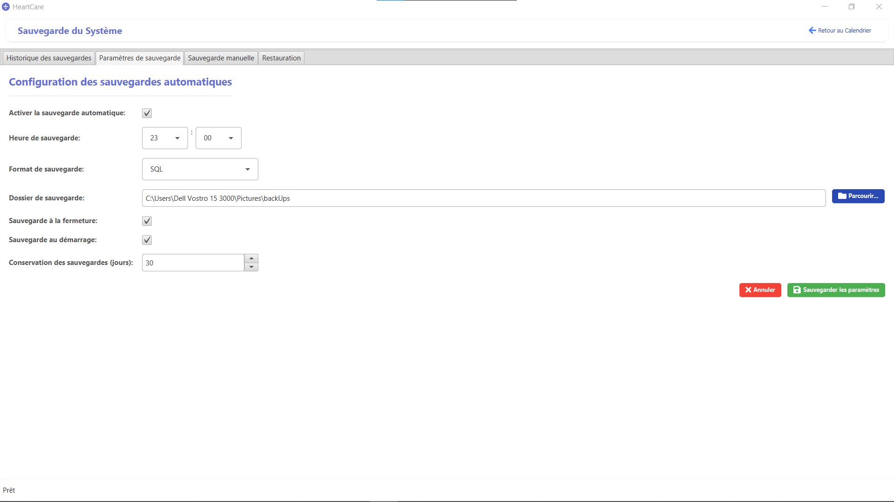

#### Manual Backup Creation
This straightforward interface enables administrators to create immediate backups. It includes options to select backup format, storage location, and add descriptive notes. The prominently displayed action button initiates the backup process with the specified settings.

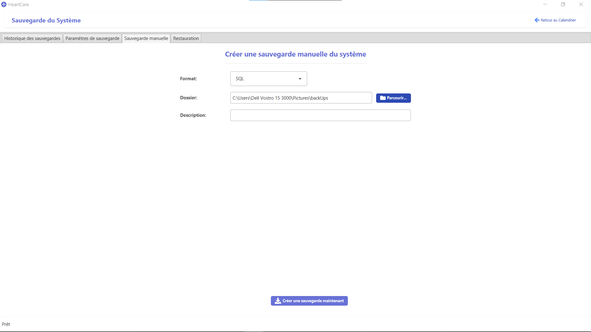

#### System Restoration
This critical interface handles system restoration from previous backups. It includes file selection for the backup, format type selection, and a clear warning about data loss during restoration. A confirmation checkbox ensures administrators understand the implications before proceeding with the restoration.

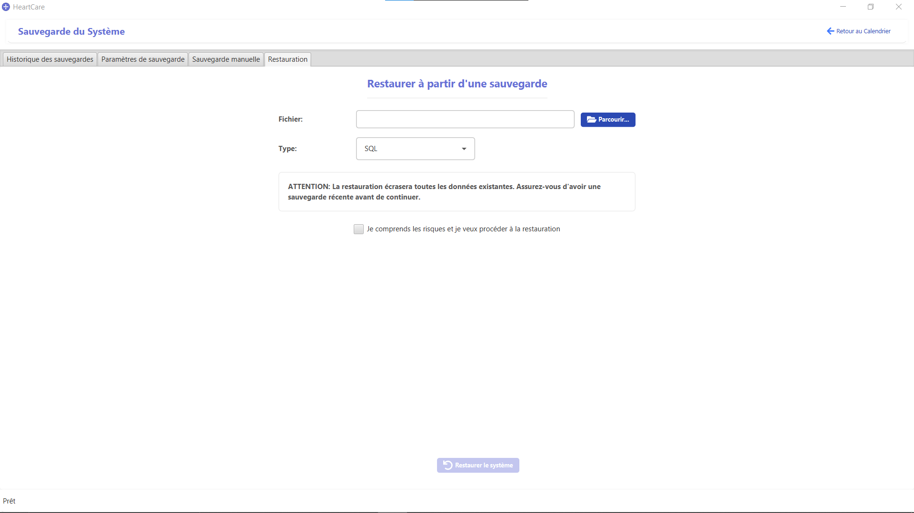

## 👥 Contributors

*Salaheddine Moujahid & Rihab Rochdi*
