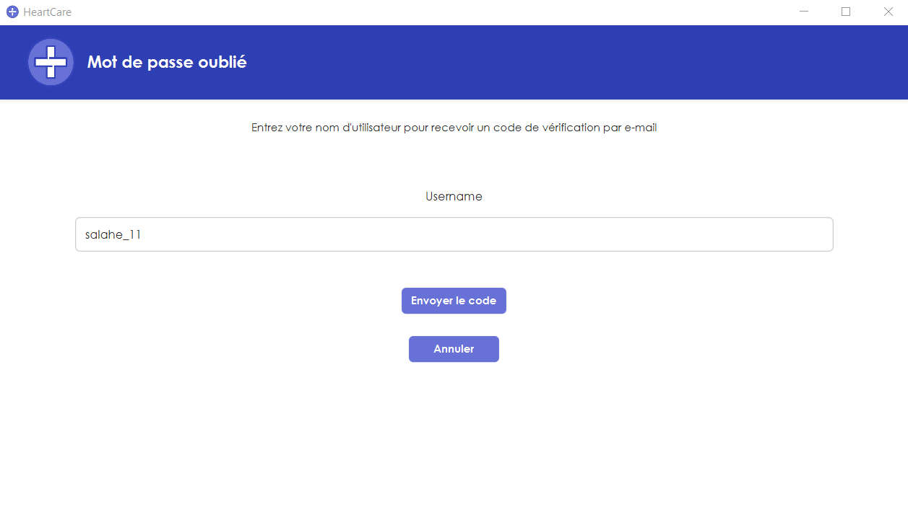
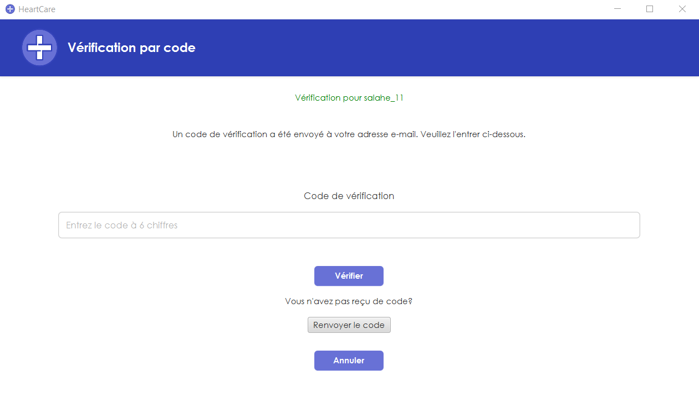
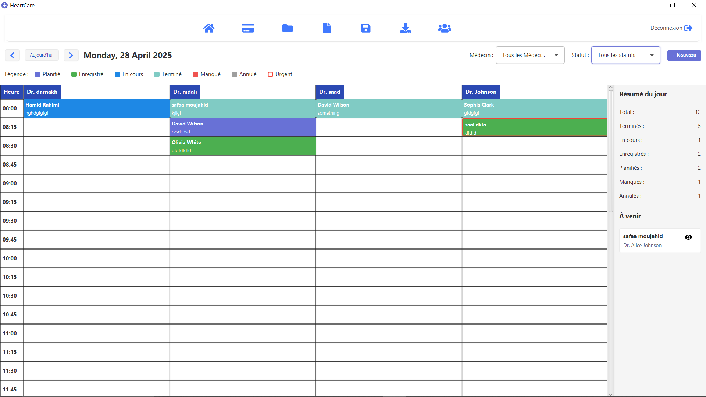

# HeartCare - Medical Clinic Management System

HeartCare is a comprehensive medical clinic management system designed to streamline patient care, appointment scheduling, medical record management, and administrative tasks. Built with JavaFX and following the MVC architecture, it provides an intuitive interface for healthcare professionals to manage their daily operations efficiently.

## 🏥 Features

### Patient Management
- Register new patients with comprehensive demographic information
- Search and filter patient records
- Edit and update patient information
- View patient history and appointments

### Appointment Scheduling
- Interactive calendar interface for appointment scheduling
- Multiple views for doctors and time slots
- Color-coded appointment status tracking (scheduled, checked-in, in progress, completed, missed, canceled)
- Quick patient check-in process

### Medical Records
- Digital patient medical records
- Track medical history, allergies, medications, and chronic conditions
- Record blood type, insurance information, and previous surgeries
- Secure access controls based on user role

### Payment Processing
- Record and track payments for appointments
- Multiple payment method support (cash, credit card, insurance)
- Generate and print invoices
- Payment history tracking

### User Management
- Role-based access control (Admin, Doctor, Staff)
- Secure authentication with password hashing
- User profiles and contact information
- Permission-based interface elements

### Analytics & Reporting
- Daily appointment summaries
- Patient demographics analysis
- Revenue tracking and financial statistics
- Custom date range filtering for reports
- Exportable PDF reports

## 💻 Technical Details

- **Language**: Java
- **UI Framework**: JavaFX
- **Architecture**: Model-View-Controller (MVC)
- **Database**: MySQL
- **Authentication**: BCrypt password hashing
- **Icons**: Ikonli icons
- **PDF Generation**: Apache PDFBox

## 🚀 Getting Started

### Prerequisites
- JDK 11 or later
- MySQL 5.7 or later
- Maven (for dependency management)

### Database Setup
1. Create a MySQL database named `heartcare`
2. Adjust the database connection settings in `DatabaseSingleton.java`:
   ```java
   private static final String URL = "jdbc:mysql://localhost:3307/heartcare";
   private static final String USER = "root";
   private static final String PASSWORD = "your_password";
   ```
3. Execute the following SQL statements to create the required tables:

```sql
-- Patient table
CREATE TABLE patient ( 
  ID varchar(8) PRIMARY KEY, 
  FNAME varchar(50), 
  LNAME varchar(50), 
  BIRTHDATE date, 
  SEXE enum('male','female'), 
  ADRESSE varchar(255), 
  TELEPHONE int, 
  EMAIL varchar(255), 
  CREATED_AT timestamp DEFAULT CURRENT_TIMESTAMP 
);

-- Medical record table 
CREATE TABLE dossierpatient ( 
  DossierID int AUTO_INCREMENT PRIMARY KEY, 
  PatientID varchar(8), 
  BloodType enum('A-','A+','B-','B+','AB-','AB+','O-','O+'), 
  Allergies text, 
  MedicalHistory text, 
  CurrentMedications text, 
  DateCreated timestamp DEFAULT CURRENT_TIMESTAMP, 
  LastUpdated timestamp DEFAULT CURRENT_TIMESTAMP ON UPDATE CURRENT_TIMESTAMP, 
  BloodPressure varchar(20), 
  ChronicConditions text, 
  PreviousSurgeries text, 
  FamilyMedicalHistory text, 
  InsuranceProvider varchar(100), 
  InsurancePolicyNumber varchar(50), 
  FOREIGN KEY (PatientID) REFERENCES patient(ID) 
);

-- Users table 
CREATE TABLE users ( 
  ID varchar(8) PRIMARY KEY, 
  USERNAME varchar(50) UNIQUE, 
  PASSWORD varchar(255), 
  FNAME varchar(50), 
  LNAME varchar(50), 
  EMAIL varchar(50), 
  TELEPHONE int, 
  ADRESSE varchar(255), 
  BIRTHDATE date, 
  ROLE enum('medecin','admin','personnel') 
);

-- Appointments table 
CREATE TABLE rendezvous ( 
  RendezVousID int AUTO_INCREMENT PRIMARY KEY, 
  PatientID varchar(8), 
  MedecinID varchar(8), 
  AppointmentDateTime datetime, 
  ReasonForVisit text, 
  Status enum('Scheduled','CheckedIn','InProgress','Completed','Missed','Rescheduled','Patient_Cancelled','Clinic_Cancelled') DEFAULT 'Scheduled', 
  DateCreated timestamp DEFAULT CURRENT_TIMESTAMP, 
  LastUpdated timestamp DEFAULT CURRENT_TIMESTAMP ON UPDATE CURRENT_TIMESTAMP, 
  StatusReason text, 
  NoShowFlag tinyint(1) DEFAULT 0, 
  RescheduledToID int NULL, 
  CancellationTime datetime NULL, 
  Priority enum('Normal','Urgent') DEFAULT 'Normal', 
  FOREIGN KEY (PatientID) REFERENCES patient(ID), 
  FOREIGN KEY (MedecinID) REFERENCES users(ID), 
  FOREIGN KEY (RescheduledToID) REFERENCES rendezvous(RendezVousID) 
);

-- Appointment history table 
CREATE TABLE rendezvous_history ( 
  HistoryID int AUTO_INCREMENT PRIMARY KEY, 
  RendezVousID int, 
  PreviousStatus enum('Scheduled','CheckedIn','InProgress','Completed','Missed','Rescheduled','Patient_Cancelled','Clinic_Cancelled'), 
  NewStatus enum('Scheduled','CheckedIn','InProgress','Completed','Missed','Rescheduled','Patient_Cancelled','Clinic_Cancelled'), 
  StatusReason text, 
  ChangedBy varchar(50), 
  ChangedAt datetime DEFAULT CURRENT_TIMESTAMP, 
  FOREIGN KEY (RendezVousID) REFERENCES rendezvous(RendezVousID) 
);

-- Payments table 
CREATE TABLE paiment ( 
  PaimentID int AUTO_INCREMENT PRIMARY KEY, 
  PatientID varchar(8), 
  RendezVousID int, 
  Amount decimal(10,2), 
  PaymentMethod enum('Cash',' Credit Card','Insurance'), 
  PaimentDate datetime DEFAULT CURRENT_TIMESTAMP, 
  FOREIGN KEY (PatientID) REFERENCES patient(ID), 
  FOREIGN KEY (RendezVousID) REFERENCES rendezvous(RendezVousID) 
);

-- Payment history table
CREATE TABLE paiment_history (
    HistoryID int AUTO_INCREMENT PRIMARY KEY,
    PaimentID int NOT NULL,
    RendezVousID int NOT NULL,
    PatientID varchar(8) NOT NULL,
    OldAmount decimal(10,2),
    NewAmount decimal(10,2),
    OldPaymentMethod enum('Cash',' Credit Card','Insurance'),
    NewPaymentMethod enum('Cash',' Credit Card','Insurance'),
    ChangedAt timestamp DEFAULT CURRENT_TIMESTAMP,
    ChangedBy varchar(50) NOT NULL,
    ChangeReason text NOT NULL,
    FOREIGN KEY (PaimentID) REFERENCES paiment(PaimentID) ON DELETE CASCADE,
    FOREIGN KEY (RendezVousID) REFERENCES rendezvous(RendezVousID),
    FOREIGN KEY (PatientID) REFERENCES patient(ID),
    INDEX (PaimentID),
    INDEX (RendezVousID),
    INDEX (PatientID)
);   
   
-- Users logs table
CREATE TABLE user_activity_log (
    log_id INT AUTO_INCREMENT PRIMARY KEY,
    user_id VARCHAR(50),
    username VARCHAR(100),
    role VARCHAR(50),
    action_type VARCHAR(20),
    timestamp DATETIME
);

```

### Running the Application
1. Clone the repository
2. Configure the database connection
3. Build the project using Maven: `mvn clean package`
4. Run the application: `java -jar target/HeartCare.jar`

## 📋 Project Structure

- `src/main/java/com/example/myjavafxapp/Models/` - Data models and business logic
- `src/main/java/com/example/myjavafxapp/Controllers/` - UI controllers
- `src/main/resources/com/example/myjavafxapp/` - FXML files and resources
- `src/main/resources/Icons/` - Application icons

## 🔐 Security Features
- Password hashing using jBCrypt
- Session management
- Role-based access control

## 📊 Screenshots
## Connexion au système
   L'écran d'accueil de HeartCare propose une interface de connexion sécurisée. Les utilisateurs peuvent saisir leurs identifiants, se connecter, s'inscrire ou récupérer un mot de passe oublié. Le design sobre met en valeur le nom du système "HeartCare" et sa qualité.

   

   ## Inscription des utilisateurs (CIN)
   Cette interface permet aux nouveaux utilisateurs de commencer leur inscription en saisissant leur numéro de CIN (Carte d'Identité Nationale). Les boutons "Soumettre" et "Annuler" permettent respectivement de valider ou d'abandonner le processus.

   

   ## Inscription des utilisateurs (Complète)
   Après validation du CIN, l'utilisateur accède à cette interface pour compléter son inscription. Il doit créer un nom d'utilisateur, un mot de passe et le confirmer. Un message de bienvenue personnalisé s'affiche (ici pour "mehdi darnakh").

   

   ## Récupération de mot de passe (Étape 1)
   Pour les utilisateurs ayant oublié leur mot de passe, cette interface permet de commencer le processus de récupération en saisissant le nom d'utilisateur et la date de naissance associée au compte.
   


   ## Récupération de mot de passe (Étape 2)
   Après vérification des informations, l'utilisateur (ici "Jane Smith") peut saisir un nouveau mot de passe et le confirmer. L'interface est sécurisée et intuitive pour ce processus critique.
   


## Liste des Utilisateurs
L'interface Gestion des utilisateurs affiche un tableau complet des utilisateurs enregistrés, incluant leurs CIN, noms, rôles (admin, personnel ou médecin), et coordonnées. Une barre de recherche permet un filtrage rapide. Le système applique des restrictions strictes sur le nombre d'utilisateurs par rôle : 1 administrateur max, 4 membres du personnel max, et 4 médecins max, assurant ainsi une gestion sécurisée des accès. La colonne "Action" permet la modification ou suppression des comptes.


## Ajout d'un Utilisateur
Le formulaire Ajouter Un Utilisateur permet a l'administrateur de créer de nouveaux comptes en saisissant les informations essentielles (CIN, nom, rôle, date de naissance, etc.). Le système vérifie automatiquement les quotas par rôle avant validation. Cette interface garantit que seuls les utilisateurs autorisés sont ajoutés, en respectant les limites définies pour chaque type de rôle.


## Gestion des dossiers patients
Cette interface centrale permet aux médecins et aux administrateurs de rechercher, d’ajouter et de modifier les dossiers patients. À gauche, une liste déroulante affiche tous les patients enregistrés ; au centre, on retrouve les informations générales (ID, nom, date de naissance, sexe, adresse, téléphone, email) et, en dessous, l’historique détaillé des rendez-vous (date, heure, médecin, motif, statut et accès rapide au détail). Deux boutons « Modifier Patient » et « Dossier Médical » autorisent la mise à jour des données, tandis qu’un bouton « Nouveau Rendez-vous » offre un raccourci pour planifier une prochaine consultation. Les médecins et l’administrateur bénéficient d’un accès complet à ces données, contrairement au personnel, qui n’a, lui, qu’un accès restreint aux seules informations d’assurance.


## Dossier médicale complète (médecins & admin)
Cette vue « Dossier médical du patient » affiche l’ensemble de l’historique médical : groupe sanguin, allergies, traitements actuels, tension artérielle, maladies chroniques, antécédents chirurgicaux et familiaux, ainsi que les dates de création et de dernière mise à jour. Un formulaire éditable permet aux médecins et aux administrateurs de saisir ou de corriger ces informations, puis d’enregistrer ou d’annuler les modifications via les boutons en bas de page. Seuls ces utilisateurs disposent de la visibilité et de la modification de tous les antécédents médicaux.


## Vue simplifiée (personnel)
Dans cette version épurée du dossier, seule la partie administrative est visible : on y lit la date de création, la date de dernière mise à jour, l’assurance et le numéro de police. Le titre rappelle l’identité du patient (CIN et nom), mais le personnel n’a accès qu’aux informations d’assurance, sans pouvoir consulter ni modifier le reste du dossier médical.


## Les statistiques
### 1. Tendances des Rendez-vous
Dans cet onglet, l’administrateur dispose d’un aperçu global de l’activité des rendez-vous sur la période sélectionnée via le panneau de filtrage (choix de l’intervalle prédéfini ou dates « Du/Au »). On y trouve quatre indicateurs clés en haut : le nombre total de rendez-vous, les rendez-vous terminés et annulés (avec pourcentages), ainsi que le taux d’absence. Un graphique circulaire détaille la répartition des statuts – enregistré, programmé, terminé, manqué, annulé, reprogrammé – et un histogramme affiche le nombre de rendez-vous par semaine. Enfin, deux tableaux classent les jours et les créneaux horaires les plus chargés, permettant d’identifier pics et creux d’activité.


### 2. Démographie des Patients
Cet onglet fournit à l’administrateur une vision complète de la composition de la patientèle durant la période choisie. On y retrouve le total des patients, la distinction entre nouveaux et récurrents, ainsi qu’un camembert pour la répartition hommes/femmes. Un histogramme adjacent présente la distribution par tranches d’âge (0-10, 11-20, etc.), révélant les segments les plus représentés. Enfin, un tableau énumère le nombre de patients par médecin, avec pourcentages, afin de mesurer l’engagement de chaque praticien.


### 3. Performance Financière
Ici, l’administrateur peut évaluer les revenus générés : revenu total, revenu moyen par rendez-vous et par patient, tous chiffrés en dirhams. L’histogramme central illustre la tendance hebdomadaire des recettes, permettant d’identifier les semaines les plus profitables. Le tableau situé en bas ventile le chiffre d’affaires par médecin, indiquant à la fois le nombre de rendez-vous facturés, le revenu total et la part relative de chaque praticien dans le revenu global.


### Note :
Ces trois interfaces de statistiques et le panneau de filtrage sont strictement réservés aux administrateurs ; seuls ils ont la possibilité d’accéder à ces rapports et de modifier la plage de données via la section de filtre en haut de l’écran.

## Payment
### 1. Main Payment Management Interface
The main payment management interface offers a dual-table layout for complete payment workflow management. The upper table displays today's completed appointments awaiting payment, allowing staff to search by patient CIN to quickly locate specific records. The lower table provides a comprehensive payment history with filtering capabilities by date and patient CIN, displaying payment details including amounts, methods, and patient information. Action buttons in both sections enable efficient payment processing, editing, and invoice generation, with a clear visual indication of payment status.


### 2. Payment Registration Dialog
The payment registration dialog presents a streamlined interface for recording new payments. It clearly displays the patient's name and appointment details at the top for verification, followed by simple input fields for the payment amount and a dropdown menu for selecting the payment method (Espèces/Cash, Carte de Crédit, Assurance). The clean, focused design eliminates distractions, allowing staff to quickly process payments with the prominent "Enregistrer" button, while the "Cancel" option allows easy return to the main interface if needed.


### 3. Payment Modification Dialog
The payment modification dialog provides a secure way to edit same-day payments with full accountability. It displays the payment ID being modified and allows staff to adjust the payment amount or change the payment method through a simple dropdown. The interface includes a mandatory reason field labeled "Raison de la modification (obligatoire)" that requires justification for any changes, ensuring proper documentation for audit purposes. The system preserves modification history while maintaining a clean, intuitive interface for quick adjustments.


### 4. Payment Invoice
The payment invoice presents a professional, well-structured receipt for patient payments. It features the clinic's information at the top, followed by clearly labeled sections for invoice details (number and date), patient information, appointment specifics (including doctor and reason for visit), and payment details (amount and method). The document includes designated signature areas for both staff and patient, providing a legally compliant record of the transaction. The clean, minimal design ensures all critical information is easily readable, making it suitable for both print and digital distribution.


## Daily Report
### 1. Daily Report Interface
The "Rapport Quotidien" interface provides clinic administrators with a comprehensive daily overview of appointment activity and patient flow. Users can easily select specific dates through the date picker at the top, with a prominent "Télécharger en PDF" button allowing instant report export. The interface displays a warning that the report is partial if the day isn't finished yet. The report is organized into clear sections: a summary showing total appointments (4), completed appointments (4), cancellations (0), and total patients seen; a detailed patient list table showing each patient's CIN, name, appointment time, and payment method; and a patient flow analysis section highlighting peak hours and appointment distribution throughout the day. This at-a-glance dashboard gives administrators immediate insights into daily clinic operations.


### 2. Daily Report Interface
The "Rapport Quotidien" interface provides clinic administrators with a comprehensive daily overview of appointment activity and patient flow. Users can easily select specific dates through the date picker at the top, with a prominent "Télécharger en PDF" button allowing instant report export. The interface displays a warning that the report is partial if the day isn't finished yet. The report is organized into clear sections: a summary showing total appointments (4), completed appointments (4), cancellations (0), and total patients seen; a detailed patient list table showing each patient's CIN, name, appointment time, and payment method; and a patient flow analysis section highlighting peak hours and appointment distribution throughout the day. This at-a-glance dashboard gives administrators immediate insights into daily clinic operations.


## Dashboard
### 1. Calendar View
This is the main calendar interface implemented in CalendarViewController.java and defined in CalendarView.fxml. It displays a time-based grid showing appointments for multiple doctors with color-coded status indicators. The interface includes navigation buttons, date selection, doctor and status filters, and a summary panel on the right showing daily statistics and upcoming appointments. The grid is dynamically populated with appointment blocks that can be clicked to manage appointments.



### 2. New Appointment Form
This appointment creation/editing interface is implemented in AppointmentFormController.java and defined in AppointmentForm.fxml. It provides a form for entering patient details (with search functionality), selecting doctors, choosing date and time, entering visit reasons, setting priority (normal or urgent), and adding notes. The form adapts based on whether it's creating a new appointment or editing an existing one, showing additional status options for existing appointments.


### 3. Appointment Actions (Scheduled Status)
This dialog is generated by the showAppointmentActionsDialog method in CalendarViewController.java. It displays actions available for a scheduled appointment, showing patient details and offering options to view/modify the appointment, register the patient's arrival (check-in), mark as missed, or cancel the appointment. These options change dynamically based on the current status of the appointment.


### 4. Appointment Actions (Checked-In Status)
Generated by the same method as Image 3, this dialog shows actions available for a checked-in patient. The patient is marked as "Enregistré" (registered/checked-in) and the dialog offers options to view/modify the appointment details or start the consultation, which would change the appointment status to "In Progress" through the handleStartAppointment method.


### 5. Appointment Actions (In Progress Status)
This dialog shows actions for an appointment currently in progress, created by the showAppointmentActionsDialog method. It displays details for a patient currently with the doctor and offers options to view/modify or complete the appointment. Selecting "Terminer" would trigger the handleCompleteAppointment method, prompting for final notes and changing the status to "Completed."


### 6. Cancel Appointment Dialog
Implemented in the handleCancelAppointment method, this dialog allows users to cancel an appointment by selecting the cancellation type (by patient or by clinic) and entering a reason. The cancellation is processed differently based on the selected type, with the system tracking who canceled and when, stored in the Appointment object and database.


### 7. Mark as Missed Dialog
Created by the handleMissedAppointment method, this simple dialog prompts for a reason when marking a patient as absent from their appointment. Upon confirmation, it updates the appointment status to "Missed" and sets the noShowFlag to true in the database. This also potentially triggers the appointment shifting functionality to fill the gap.


### 8. Appointment Actions (Missed Status)
This dialog shows actions available for a missed appointment through the showAppointmentActionsDialog method. It displays the missed status and offers options to view/modify or reschedule the appointment. The reschedule option would trigger the handleRescheduleAppointment method which displays the rescheduling dialog.


### 9. Reschedule Appointment Dialog
Generated by the handleRescheduleAppointment method, this dialog allows rescheduling a missed appointment by selecting a new date and time and providing a reason. The system creates a new appointment record while updating the original one to "Rescheduled" status with a reference to the new appointment ID, maintaining a history of the change.


## 👥 Contributors

*Salaheddine Moujahid & Rihab Rochdi*
